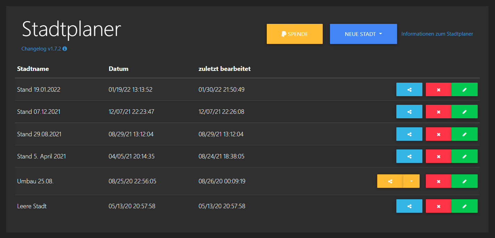
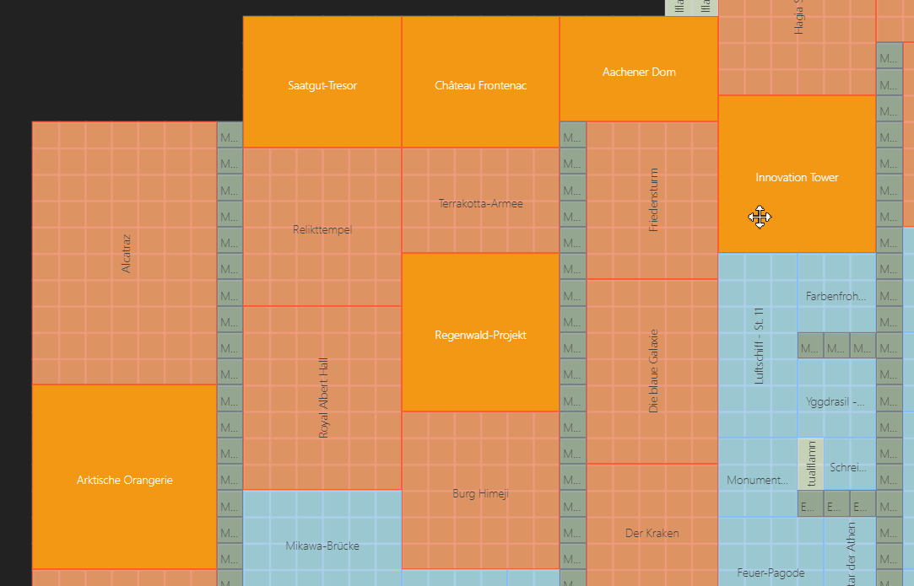
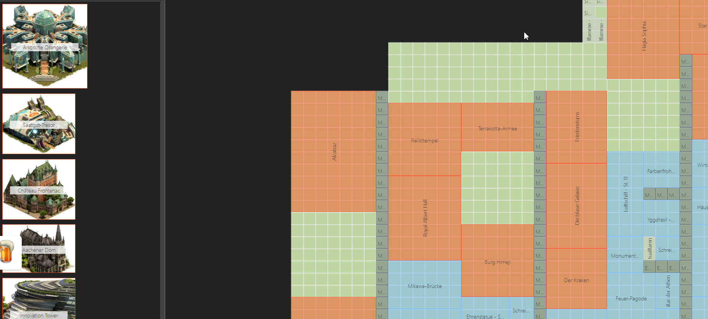
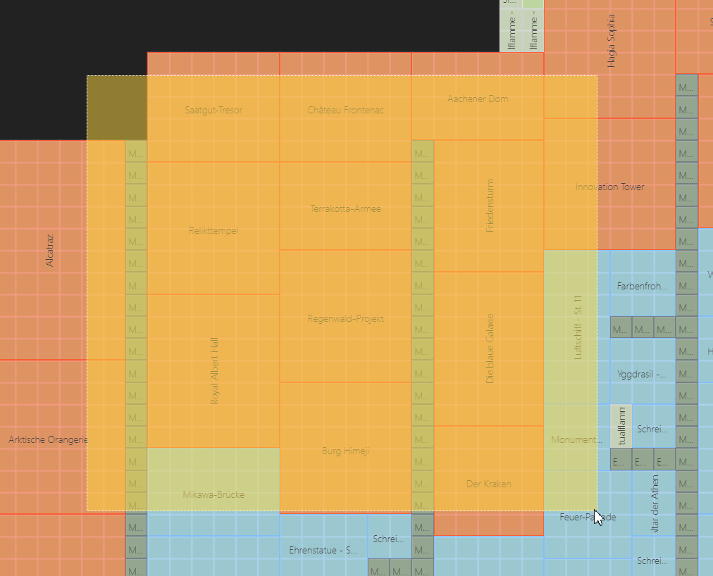
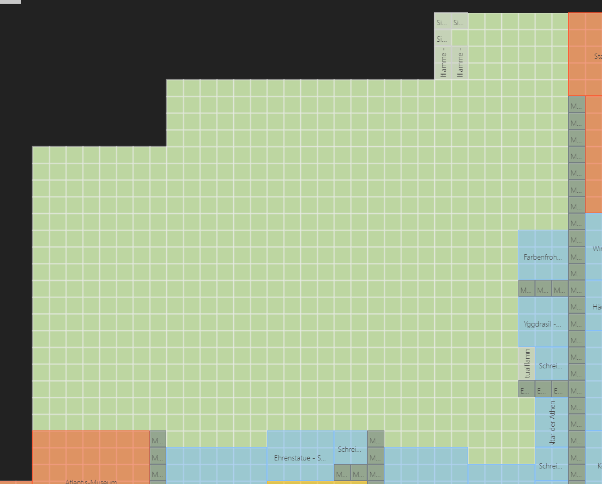
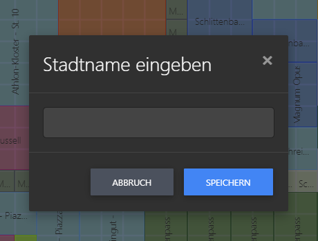
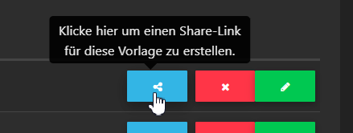
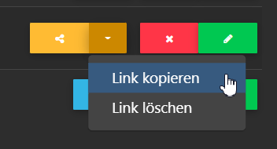

# Stadtplaner

## Was kann dieses Tool?
Um verschiedene Varianten einer Stadt zu planen oder aber um die Stadt von einem Gilden - Kollegen oder Freund planen zu lassen ist dieses Tool genau das richtige.
Dazu kannst Du einen Share-Link weiter geben, der es dem Bearbeiter ermöglicht Deine Stadt zu planen.

## Übersicht

Den Stadtplaner erreichst Du auf der Webseite oben über das Menü "Tools":

In der Übersicht erscheinen deine Städte. Deine Hauptstadt, aber auch alle deine Außenposten wenn Du die denn hier hochgeladen und gespeichert hast:

## Stadt bearbeiten

Mit einem Klick auf "Neue Stadt" wird Dir angezeigt welche Daten vorliegen. Diese musst Du von der FoE-Helfer Erweiterung an diesen Server geschickt haben. 
Das wird meist Deine Stadt selbst und/oder der letzte Außenposten den Du übermittelt hast sein.

Beim ersten Aufruf liegen immer alle Gebäude in der Map. Deine Stadt ist ja auch so aufgebaut.

---

Mit einem Klick auf "Stadt leeren" verschiebst Du alle Gebäude auf der Map nach links in die Sitebar.

---

Du kannst aber auch mit STRG + linker Maustaste einzelne Gebäude markieren...

... und mit der Taste "Entf" in die Sidebar verschieben lassen.

Mit Shift + linker Maustaste kannst Du außerhalb der Map beginnend ein Viereck über die Gebäude ziehen die Du anschließend ebenfalls mit der Taste "Entf" zur Sidebar schicken möchtest:

Es werden alle Gebäude beachtet, die das orangen Viereck berühren. Das Gebäude muss nicht komplett darin liegen.

Mit diesen Hilfen musst Du nicht jedes einzelne Gebäude nach links schieben. Was natürlich auch geht.

---

Zum Speichern gibt es zwei Optionen. Beim ersten Speichern wirst Du nach einem Namen gefragt. 
Hast Du das erfolgreich gespeichert wird ab sofort im Hintergrund Deine Stadt alle 30s automatisch gespeichert.

Öffnest Du eine bereits vorhandene Stadt, wird diese sofort alle 30s nach dem Öffnen im Hintergrund gesichert. So geht kein Fortschritt verloren.

---

Falls Dir weitere Monitore fehlen kannst DU Deine Stadt entweder als Grafik oder als transparente PNG-Grafik abspeichern. 
Das machst Du mit den Buttons "PDF Download" oder "PNG Download". 

## Stadt freigeben

Möchtest Du das jemand anderes für Dich Deine Stadt plant, kannst Du in der Übersicht einen "Share Link" erzeugen lassen:

---

Mit einem Klick auf kopieren wird dir dieser in die Zwischenablage deines Gerätes kopiert:

Löscht Du den Share link, kann die Stadt nicht wieder unter diesem aufgerufen werden. Du musst einen neuen erzeugen und diesen wieder weiter geben.

